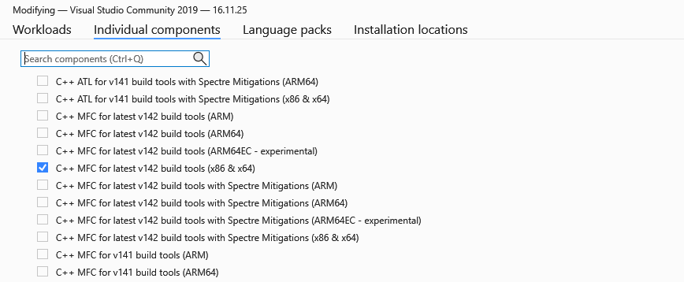
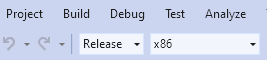
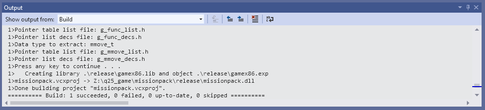

# Quake 2's 25th anniversary UNIT

This is the source code for the game DLL of the Quake 2's 25th anniversary UNIT.

## How to build

1. Download and install Visual Studio 2019.
2. Use the Visual Studio installer to modify the Visual Studio 2019 installation in order to add the C++ MFC for latest v142 build tools (x86 & x64) component.
[]

3. Open missionpack.dsp with Visual Studio 2019 and allow it to convert the project file.

4. Switch from Debug to Release for x86 then go into the Build menu and hit Build Solution.
[]

5. May need to Build Solution again if it gives an error regarding the pointer table list file.
[]

## Code contributors

- gnemeth
- Quakeulf
- Phatman
- Nephatrine
- EmeraldTiger
- Guggenheim
- Fix